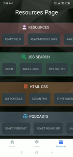

  </img>

<h1 align="center">React Finder App - guide to React JavaScript library</h1>

This is React Native Application with the integration of tools such as Redux, React Context and Hooks, Styled Components, Lottie Animations. Firebase Authentication, QraphQl (all data published and managed at Contentful).
Project fully ready for IOS, Android deployment. Responsive Design for Tablets and Phones. Published at Expo Store.
Application created for community as links to Free Helpful Resources, which cover React, React Native, Redux and GraphQl materials.

---

<h2 align="center"> Technologies</h2>

Project is created with:

- React: 16.9.0
- React Redux: 7.2.0
- Expo: 37.0.3
- Styled Components: 5.1.0
- Contentful: 7.14.2
- Firebase: 7.14.0
- Lottie: 3.3.2

---

<h2 align="center"> Launch and Content</h2>

To launch this project, go to https://expo.io/@andrewzer/react-finder

  
Or scan the QR code in Expo Client Right Away

  

<h3 align="center">Main Page Navigation</h3>

Loading page for upload content from Contentful, Basic Main page Navigation with horizontal and vertical slides.

  <table>
    <tr>
      <th></th>
      <th></th>
    </tr>
  <tr>
    <td>
      
    </td>
    <td>
      
    </td>
  </tr>
  </table

<h3 align="center">SignUp and Login</h3>

Firebase Authentication with Lottie Success Login Animation. Personal Account.

  <table>
    <tr>
      <th>Sign Up</th>
      <th>Log In</th>
    </tr>
    <tr>
      <td>
        
      </td>
      <td>
        
      </td>
    </tr>
  </table

<h3 align="center">Courses and Resources Navigation</h3>

React, React Native, Redux and GraphQl courses and helpful resources.

  <table>
    <tr>
      <th>Courses Page</th>
      <th>Resources Page</th>
    </tr>
    <tr>
      <td>
        
      </td>
      <td>
        
      </td>
    </tr>
  </table

<h3 align="center">Extra Main Page Functionality</h3>

Articles, Notifications with Card's Animation, Filtered courses by platform

  <table>
    <tr>
      <th>Articles</th>
      <th>Notifications</th>
      <th>Courses by platform</th>
    </tr>
    <tr>
      <td>
        
      </td>
      <td>
        
      </td>
      <td>
        
      </td>
    </tr>
  </table

---

<h2> Support</h2>

Reach out to me at one of the following places!

- Website at [React Finder](https://react-finder.netlify.app/)
- Twitter at [AndrewZer](https://twitter.com/AndrewZer)
- LinkedIn at [Andrew Zernov](https://www.linkedin.com/in/andrei-zernov/)

---

<h2> License</h2>

MIT license 

Copyright 2020 © React Finder

